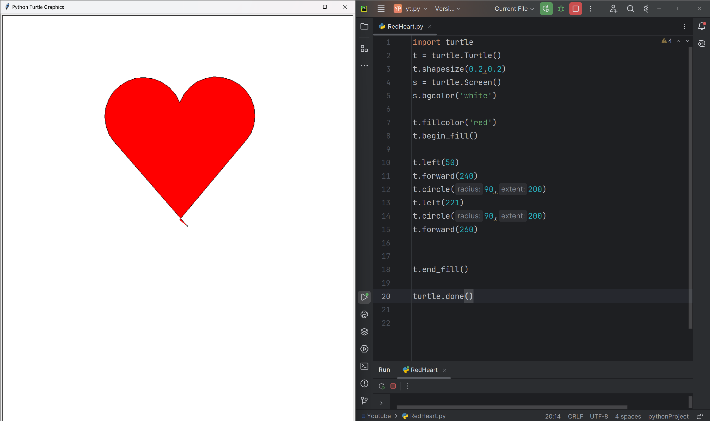

# Red Heart

A simple Python script that generates a heart shape using the Turtle graphics library. The Heart Turtle is a fun and easy project for beginners, perfect for learning the basics of Turtle graphics.

# Tutorial is available on youtube channel 
click on the link to see :- ([Open in Youtube](https://youtu.be/7i38TQ6BR9s))

# Screenshot

Red Heart

# Features:

Generates a beautiful, heart-shaped pattern with a solid fill color
Uses the Turtle graphics library for a retro, nostalgic feel
Perfect for beginners and coding enthusiasts alike
Getting Started:

Clone the repository to your local machine
Run the heart_turtle.py script using Python 3.x
Watch as the Heart Turtle comes to life on your screen!

# Contributing:

Feel free to modify the script, experiment with different shapes and colors, and share your creations with the community! Pull requests are welcome.

# License:

This repository is licensed under the MIT License. See LICENSE for details.

The Heart Turtle is a great way to learn the basics of Turtle graphics and create a fun, visually appealing project. The use of the shapesize and fillcolor functions allows for easy customization and experimentation, making it a perfect project for beginners and coding enthusiasts alike.

# snake.coding
We create a project each 4 days with voting on our <a href="https://youtube.com/@snakecoding_12" target="_blank">Youtube</a> channel.
You can vote for upcoming projects on our channel **community** page :wink:

